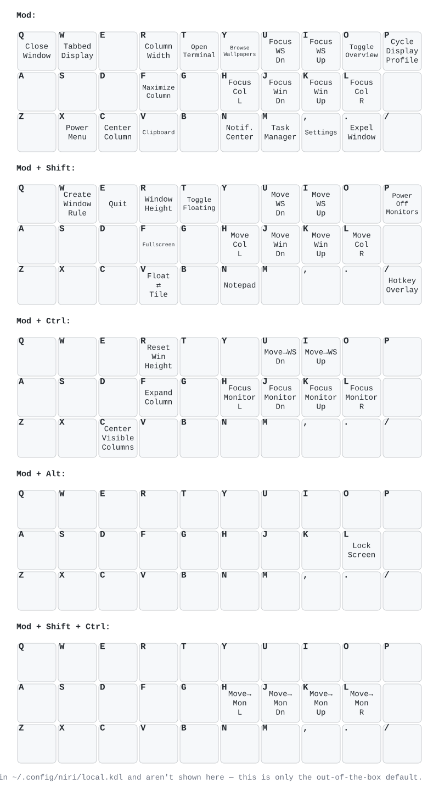

# Niri keymap visualization

Visual reference for Roshar's default niri bindings, generated with
[keymap-drawer](https://github.com/caksoylar/keymap-drawer), applied here to Roshar's
*default*, vendored bindings rather than a personal layer, since Roshar ships none. Five
layers, one shared physical layout: **Mod** (bare `Mod+<key>`), **Mod + Shift**,
**Mod + Ctrl**, **Mod + Alt**, **Mod + Shift + Ctrl** (the only combos actually used
anywhere in `binds.kdl`).



| File | What |
|------|------|
| `keymap.svg` | Rendered diagram (embedded above; also open directly in a browser) |
| `keymap.yaml` | [keymap-drawer](https://github.com/caksoylar/keymap-drawer) source for the SVG |
| `draw.sh` | Regenerates `keymap.svg` from `keymap.yaml` |

Every layer covers the same 29 keys: all 26 letters plus `,` `.` `/`, laid out in true
physical QWERTY position (`Q W E R T Y U I O P` / `A S D F G H J K L` / `Z X C V B N M , . /`
— the blank slot on row 2 is where `;` would physically sit, out of scope here). A blank
key means nothing is bound there by default. **Mod + Alt** only has one binding at all
(`L`, Lock Screen) — everything else on that layer is genuinely free.

The diagram reflects `files/skel-niri/dms/binds.kdl` only — the single file that backs
every default niri keybinding in Roshar, both baked into the image
(`Containerfile`'s `COPY files/skel-niri/ /usr/share/roshar/niri-default-config/`) and
copied byte-identical into `~/.config/niri/` on first login by
`files/roshar-seed-niri-config`. There's no separate build-time vs. seed-time content to
reconcile, and no personal override layer to show — Roshar itself is vanilla by design
("bring your own `~/.config/niri/local.kdl`").

`Super+X` (Power Menu) is drawn on the `Mod` layer alongside every other `Mod+<key>` bind,
even though `binds.kdl` writes it as `Super+X` rather than `Mod+X` like everything else:
[niri's own docs](https://github.com/YaLTeR/niri/wiki/Configuration:-Key-Bindings) define
`Mod` as equal to `Super` on a native (TTY) session, which is how Roshar always runs it —
so the two are the same key here, not a real distinction.

Out of scope for this diagram, deliberately: arrows, `Home`/`End`, `Page_Up`/`Page_Down`,
number keys, mouse wheel scroll, `Minus`/`Equal`, `BracketLeft`/`BracketRight`,
function/media keys (`Print`, `XF86Launch1`, `XF86Audio*`, `XF86MonBrightness*`), `Escape`,
and the handful of non-`Mod` combos (`Ctrl+Alt+Delete`, `Ctrl+Shift+R`, `Alt+Space`, and
`config.kdl`'s own `recent-windows` block: `Alt+Tab`, `Alt+Shift+Tab`, `Alt+grave`,
`Alt+Shift+grave`) — read those straight from `files/skel-niri/dms/binds.kdl` and
`files/skel-niri/config.kdl`.

## Regenerate

```sh
pip install keymap-drawer   # one-time
./draw.sh
```

`keymap.yaml` is hand-curated, not derived from `binds.kdl` — re-edit it by hand whenever
a default binding changes, then re-run `draw.sh`.
